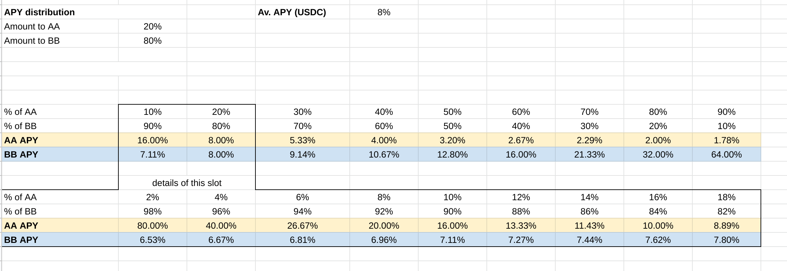

# Idle Continuous Tranches
The aim of Continuous Tranches is to pool capital of users (eg DAI), deposit it into a lending provider (eg Idle Finance) and split the interest received between 2 classes of users with different risk profiles, one will gain more interest and will be more risky (BB or junior tranche) and the other will have a lower interest but more safety (AA or senior tranche).
In case of hack of the lending provider integrated (or any other protocol integrated by this provider) all funds still available will be used to refund senior tranche holders first and with remaining funds, if any,
junior holders after.

There are no locking period or epochs and users are free to enter and exit at any time, the interest earned
(and governance tokens, after being sold in the market) will be splitted according to a predefined ratio called `trancheAPRSplitRatio` (eg 80% interest to BB and 20% to AA holders) so the rate is variable for both classes of tranches.

To calculate the actual APR for each class of tranches we need to know the ratio between the current underlying value of AA and BB tranches, below are some examples



Given that AA have less risk they should also have a lower apr than BB, so the ratio of AA should be
greater than the `trancheAPRSplitRatio` (eg if the interest for AA is 20% of the total interest earned then more than 20% of the total tranches value should be of AA tranches), this behaviour should be market driven given the different rights the users have in case of hack. The ratio between tranches heavily influences the apr of both classes of users and the aim should be to have skewed results wrt the basic lending provider but not too much skewed otherwise one of the 2 classes won't have enough holders. So there is also a `trancheIdealWeightRatio` which represent the ideal ratio between AA and BB. To incentivize the reach of `trancheIdealWeightRatio` part of farmed governance tokens may be distributed to stakers (eg stkAAVE or IDLE) in a separte contract.

In case of hack, an emergency shutdown can be triggered in order to pause both deposits and redeems, the redistribution of remaining funds can happens selectively (by allowing eg only AA holders to withdraw) directly in the main contract, or in a separate contract for more complex cases and resolutions (managed by the Idle governance).

## Architecture
The main contract which will be used by users is `IdleCDO` which allow them to deposits underlying and mint tranche tokens, either AA or BB, and redeem underlyings from it. The IdleCDO references an `IIdleCDOStrategy` and the first strategy proposed is `IdleStrategy` which uses Idle finance as a lending provider. Governance tokens are not redistributed to users directly in the IdleCDO contract but rather sold to the market (`harvest` method) and the underlyings reinvested in the downstream lending provider where possibile. For other tokens, eg IDLE that won't be sold or stkAAVE that have no liquid markets due to locking, those will get redistributed for people who staked their tranches in a separate contract (still TBD)

Notes:
IdleCDO and IdleStrategy are upgradable contracts.
There are no 'loose' scripts but only hardhat tasks which are used both for interacting with contracts and tests in fork

## TODO
- Tests for tranches price
- Define how to redistribute part of the rewards to reach the `trancheIdealWeightRatio` (separate contract)
- Define how to take fees
- Define reimbursement hack plan

- Support multiple concurrent strategies

## Setup

```
yarn install
```

## Integration tests

Copy the `.env.public` in a new `.env` file and fill out the keys OR in terminal:

```
export ALCHEMY_API_KEY=XXXX && export ETHERSCAN_API_KEY=XXXXX
```

then

```
npx hardhat buy
```
or any other tasks in `tasks/*`

## Unit Tests

Comment the
```
forking: {
  url: `https://eth-mainnet.alchemyapi.io/v2/${process.env.ALCHEMY_API_KEY}`,
  blockNumber: 12554260, // DAI all in compound
}
```
block in `hardhat.config.js` and then run

```
npx hardhat test
```

### Deploy

```
npx hardhat deploy --network YOUR_CONFIGURED_NETWORK
```

## Solidity linter

```
npx hardhat check
```

## Coverage

```
npx hardhat coverage
```
